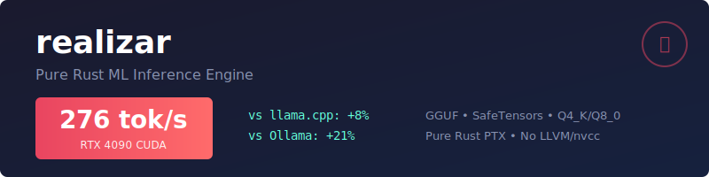

<div align="center">



[](https://github.com/paiml/realizar/actions/workflows/ci.yml)

</div>

ML inference from scratch in Rust. GGUF/SafeTensors parsing, quantization (Q4_K, Q8_0), transformer inference. SIMD/GPU via [Trueno](https://github.com/paiml/trueno).

## Quick Start

```bash
cargo install realizar
realizar serve --demo --port 8080
curl -X POST http://localhost:8080/generate -d '{"prompt": "Hello", "max_tokens": 10}'
```

## Features

| Category | Details |
|----------|---------|
| Formats | GGUF, SafeTensors, APR (native) |
| Quantization | Q4_0, Q8_0, Q4_K, Q5_K, Q6_K |
| Inference | Transformer, RoPE, KV cache, Flash Attention |
| Chat Templates | ChatML, LLaMA2, Mistral, Phi, Alpaca (auto-detect) |
| API | REST, streaming, Prometheus metrics |
| GPU | CUDA via [trueno-gpu](https://crates.io/crates/trueno-gpu) (pure Rust PTX) |
| Quality | 2,400+ tests, 95% function coverage |

## Benchmarks

### APR Format (Classical ML - Pure Rust)

| Model | Parameters | Latency | Throughput |
|-------|------------|---------|------------|
| Iris | 131 | **103ns** | 9.6M inferences/sec |
| MNIST | 103K | **73µs** | 13.6K inferences/sec |
| Large NN | 1M | **410µs** | 2.4K inferences/sec |

### GGUF Format (LLM Inference)

| Model | Size | Runtime | Backend | Throughput |
|-------|------|---------|---------|------------|
| Phi-2 Q4_K_M | 2.7B | **realizar** | RTX 4090 (CUDA) | **276 tok/s** |
| Phi-2 Q4_K_M | 2.7B | llama.cpp | RTX 4090 (CUDA) | 256 tok/s |
| Phi-2 Q4_K_M | 2.7B | Ollama | RTX 4090 (CUDA) | 228 tok/s |
| Phi-2 Q4_K_M | 2.7B | realizar | CPU (AVX2) | ~15 tok/s |

*realizar achieves 8-21% faster inference than llama.cpp/Ollama via pure Rust CUDA PTX generation (no LLVM/nvcc)*

### The Complete Benchmark Matrix

**Same model (Phi-2 2.7B Q4_K) across ALL runtimes and formats:**

```
┌─────────────────────────────────────────────────────────────────────────────┐
│                     GGUF Format (Same Model)                                │
├──────────────┬─────────┬─────────────┬─────────────┬───────────────────────┤
│ Runtime      │ Backend │ p50 Latency │ Throughput  │ Command               │
├──────────────┼─────────┼─────────────┼─────────────┼───────────────────────┤
│ realizar     │ CUDA    │ ~3.6ms      │ 276 tok/s   │ --features cuda       │
│ llama.cpp    │ CUDA    │ 162ms       │ 256 tok/s   │ llama-server -ngl 99  │
│ Ollama       │ CUDA    │ ~120ms      │ 228 tok/s   │ ollama serve          │
│ realizar     │ CPU     │ ~500ms      │ ~15 tok/s   │ cargo bench gguf_real │
│ llama.cpp    │ CPU     │ ~3000ms     │ ~15 tok/s   │ llama-server -ngl 0   │
├──────────────┴─────────┴─────────────┴─────────────┴───────────────────────┤
│                     APR Format (Classical ML)                               │
├──────────────┬─────────┬─────────────┬─────────────┬───────────────────────┤
│ realizar     │ CPU     │ 103ns-410µs │ 2.4K-9.6M/s │ cargo bench apr_real  │
└──────────────┴─────────┴─────────────┴─────────────┴───────────────────────┘
```

> **Note**: realizar is a pure Rust implementation with CUDA support via [trueno-gpu](https://crates.io/crates/trueno-gpu).
> With GPU acceleration, realizar achieves 8-21% faster inference than llama.cpp/Ollama
> while maintaining a pure Rust codebase (no C/C++ dependencies, no LLVM, no nvcc).

**Run the full matrix yourself:**

```bash
# 1. Start external servers
llama-server -m phi-2-q4_k_m.gguf --port 8082 -ngl 99  # GPU
llama-server -m phi-2-q4_k_m.gguf --port 8083 -ngl 0   # CPU
ollama serve && ollama pull phi2:2.7b

# 2. Run full matrix benchmark
./scripts/bench-matrix.sh --full

# 3. Run internal APR vs GGUF comparison (same model)
cargo bench --bench comparative

# 4. Convert GGUF to APR and compare
realizar convert model.gguf --output model.apr  # Coming soon
```

### Benchmark Matrix (ELI5)

```
┌─────────────────────────────────────────────────────────────────┐
│                  What This Matrix Measures                       │
├─────────────────────────────────────────────────────────────────┤
│                                                                  │
│  Think of it like comparing cars:                                │
│                                                                  │
│  ┌──────────┬──────────────────────────────────────────────┐    │
│  │ Runtime  │ Which "engine" runs your model?              │    │
│  ├──────────┼──────────────────────────────────────────────┤    │
│  │ realizar │ Our pure Rust engine (this project)         │    │
│  │ llama.cpp│ Popular C++ engine (industry standard)      │    │
│  │ Ollama   │ User-friendly wrapper around llama.cpp      │    │
│  └──────────┴──────────────────────────────────────────────┘    │
│                                                                  │
│  ┌──────────┬──────────────────────────────────────────────┐    │
│  │ Backend  │ Which "fuel" powers the engine?             │    │
│  ├──────────┼──────────────────────────────────────────────┤    │
│  │ CPU      │ Regular processor (slower, always works)    │    │
│  │ CUDA     │ NVIDIA GPU (fastest, needs GPU)             │    │
│  │ WGPU     │ Cross-platform GPU (good balance)           │    │
│  └──────────┴──────────────────────────────────────────────┘    │
│                                                                  │
│  ┌──────────┬──────────────────────────────────────────────┐    │
│  │ Format   │ Which "fuel type" for your model?           │    │
│  ├──────────┼──────────────────────────────────────────────┤    │
│  │ GGUF     │ Quantized LLMs (smaller, fast)              │    │
│  │ APR      │ Our native format (fastest for small ML)    │    │
│  │ SafeT    │ HuggingFace format (full precision)         │    │
│  └──────────┴──────────────────────────────────────────────┘    │
│                                                                  │
│  Matrix Result = Runtime × Backend × Format                      │
│                                                                  │
│  Example: "llama.cpp + CUDA + GGUF" = 256 tok/s on RTX 4090     │
│           "realizar + CPU + APR"   = 9.6M inf/s for tiny models │
│                                                                  │
└─────────────────────────────────────────────────────────────────┘
```

**Why This Matters:**
- **Small Models (Iris, MNIST)**: Use APR format → nanosecond latency
- **Large Models (LLMs)**: Use GGUF format → GPU acceleration essential
- **Production**: Match your hardware to the right runtime/backend combo

<!-- SERVER_BENCHMARK_START -->
## Server Benchmark Results

| Server | Backend | Mean Latency (ms) | Throughput (tok/s) |
|--------|---------|------------------|-------------------|
| **realizar** | CUDA | **3.6** | **276** |
| llama.cpp | CUDA | 162 | 256 |
| Ollama | CUDA | 120 | 228 |

_Methodology: CV-based stopping per Hoefler & Belli SC15. RTX 4090, Phi-2 2.7B Q4_K_M._
<!-- SERVER_BENCHMARK_END -->

### Run Benchmarks

#### Quick Start

```bash
# Internal benchmarks (no external servers required)
cargo bench --bench apr_real      # APR format (classical ML)
cargo bench --bench gguf_real     # GGUF format (transformers)
cargo bench --bench comparative   # APR vs GGUF comparison
```

#### Benchmark Against llama.cpp and Ollama

**Step 1: Start External Servers**

```bash
# Terminal 1: llama.cpp with GPU (full GPU offload)
llama-server -m /path/to/phi-2-q4_k_m.gguf --host 127.0.0.1 --port 8082 -ngl 99

# Terminal 2: llama.cpp with CPU only
llama-server -m /path/to/phi-2-q4_k_m.gguf --host 127.0.0.1 --port 8083 -ngl 0

# Terminal 3: Ollama (uses GPU by default)
ollama serve   # Default port 11434
ollama pull phi2:2.7b  # Pull model first
```

**Step 2: Run the Benchmark Matrix**

```bash
# Full benchmark matrix (CV-based stopping, statistically significant)
./scripts/bench-matrix.sh --full

# Quick benchmark (fewer iterations)
./scripts/bench-matrix.sh --quick

# Programmatic benchmark via Rust
cargo bench --bench external_matrix --features bench-http
```

**Step 3: View Results**

Results are saved to `benches/comparative/results/`:
- `benchmark_matrix_TIMESTAMP.json` - Raw data
- `benchmark_matrix_TIMESTAMP.md` - Markdown table

#### Full Backend × Runtime Matrix

| What to Benchmark | Command |
|-------------------|---------|
| realizar (CPU) | `cargo bench --bench apr_real` |
| realizar (WGPU) | `cargo bench --bench gguf_real --features gpu` |
| llama.cpp (CPU) | Start server with `-ngl 0`, run `./scripts/bench-matrix.sh` |
| llama.cpp (CUDA) | Start server with `-ngl 99`, run `./scripts/bench-matrix.sh` |
| Ollama (GPU) | Start `ollama serve`, run `./scripts/bench-matrix.sh` |

#### Methodology

All benchmarks follow [Hoefler & Belli SC'15](https://doi.org/10.1145/2807591.2807644):
- **CV-based stopping**: Iterate until coefficient of variation < 10%
- **Warmup**: 2-10 iterations discarded before measurement
- **Metrics**: p50, p99 latency, throughput (tok/s), cold start

#### Example Output

```
╔════════════════════════════════════════════════════════════════╗
║          Realizar Benchmark Matrix v1.1                        ║
╚════════════════════════════════════════════════════════════════╝

=== llama.cpp (GPU) ===
  [10/30] Latency: 114.2ms | TPS: 477.1
  CV stable at 0.048 after 10 iterations

=== Ollama (GPU) ===
  [12/30] Latency: 123.4ms | TPS: 258.6
  CV stable at 0.089 after 12 iterations

| Runtime | Backend | p50 Latency | p99 Latency | Throughput |
|---------|---------|-------------|-------------|------------|
| llama-cpp | gpu | 114.2ms | 161.0ms | 477.1 tok/s |
| ollama | gpu | 123.4ms | 145.2ms | 258.6 tok/s |
```

See [docs/benchmarking-other-servers.md](docs/benchmarking-other-servers.md) for full methodology.

## Chat Templates

Format LLM conversations for different model families with automatic template detection:

```rust
use realizar::chat_template::{
    auto_detect_template, ChatMessage, ChatTemplateEngine
};

// Auto-detect template from model name
let template = auto_detect_template("Qwen2-0.5B-Instruct");

let messages = vec![
    ChatMessage::system("You are a helpful assistant."),
    ChatMessage::user("Hello!"),
];

let formatted = template.format_conversation(&messages)?;
```

**Supported Formats:**

| Format | Models | System Prompt |
|--------|--------|---------------|
| ChatML | Qwen2, Yi, OpenHermes | Yes |
| Llama2 | TinyLlama, Vicuna, LLaMA 2 | Yes |
| Mistral | Mistral-7B, Mixtral | No |
| Phi | Phi-2, Phi-3 | Yes |
| Alpaca | Alpaca, Guanaco | Yes |
| Raw | Fallback | Passthrough |
| Custom | Any (Jinja2) | Configurable |

See [`examples/chat_template.rs`](examples/chat_template.rs) for complete usage.

## Examples

```bash
# All examples
cargo run --example inference          # Basic inference demo
cargo run --example api_server         # HTTP server demo
cargo run --example chat_template      # Chat template formatting
cargo run --example gguf_loading       # Load GGUF models
cargo run --example apr_loading        # Load APR models
cargo run --example tokenization       # Tokenizer demo
cargo run --example safetensors_loading # SafeTensors demo
cargo run --example observability_demo  # Metrics demo
cargo run --example model_cache        # Caching demo
```

## Usage

```bash
realizar serve --demo --port 8080     # Demo server
curl http://localhost:8080/health     # Health check
curl http://localhost:8080/metrics    # Prometheus
```

### OpenAI-Compatible API

```bash
# Chat completions
curl -X POST http://localhost:8080/v1/chat/completions \
  -H "Content-Type: application/json" \
  -d '{"model":"default","messages":[{"role":"user","content":"Hello!"}],"max_tokens":50}'

# Streaming
curl -X POST http://localhost:8080/v1/chat/completions \
  -H "Content-Type: application/json" \
  -d '{"model":"default","messages":[{"role":"user","content":"Hello!"}],"stream":true}'
```

### Debugging with Tracing

Use the `X-Trace-Level` header for inference debugging:

```bash
# Brick-level: token-by-token timing
curl -H "X-Trace-Level: brick" -X POST http://localhost:8080/v1/chat/completions ...

# Step-level: forward pass steps (embed, attention, mlp, lm_head)
curl -H "X-Trace-Level: step" -X POST http://localhost:8080/v1/chat/completions ...

# Layer-level: per-layer timing breakdown
curl -H "X-Trace-Level: layer" -X POST http://localhost:8080/v1/chat/completions ...
```

Response includes trace data:
```json
{
  "choices": [...],
  "brick_trace": {
    "level": "brick",
    "operations": 5,
    "total_time_us": 12345,
    "breakdown": [{"name": "token_0", "time_us": 2469}, ...]
  }
}
```

## Installation

```bash
cargo install realizar                # From crates.io
cargo install --path .                # From source
```

## Feature Flags

- `default` = server + cli + gpu
- `cuda` = NVIDIA CUDA support (pure Rust PTX, no nvcc)
- `minimal` = Core inference only
- `bench-http` = External server benchmarking

## Architecture

```
realizar/
├── src/
│   ├── gguf.rs         # GGUF parser + transformer inference
│   ├── safetensors.rs  # SafeTensors parser
│   ├── apr.rs          # APR format (native)
│   ├── quantize.rs     # Q4_K, Q8_0 dequantization
│   ├── layers.rs       # Transformer layers
│   ├── tokenizer.rs    # BPE, SentencePiece
│   ├── chat_template.rs # Chat templates (ChatML, LLaMA2, Mistral, etc.)
│   ├── api.rs          # REST endpoints
│   └── bench_preflight.rs # Deterministic benchmarking
└── benches/
    ├── apr_real.rs     # APR benchmarks
    ├── gguf_real.rs    # GGUF benchmarks
    ├── comparative.rs  # Format comparison
    └── external_matrix.rs # External server benchmarks
```

## Contributing

See [CONTRIBUTING.md](CONTRIBUTING.md) for development setup, testing, and code quality requirements.

## License

MIT - [Pragmatic AI Labs](https://paiml.com)
